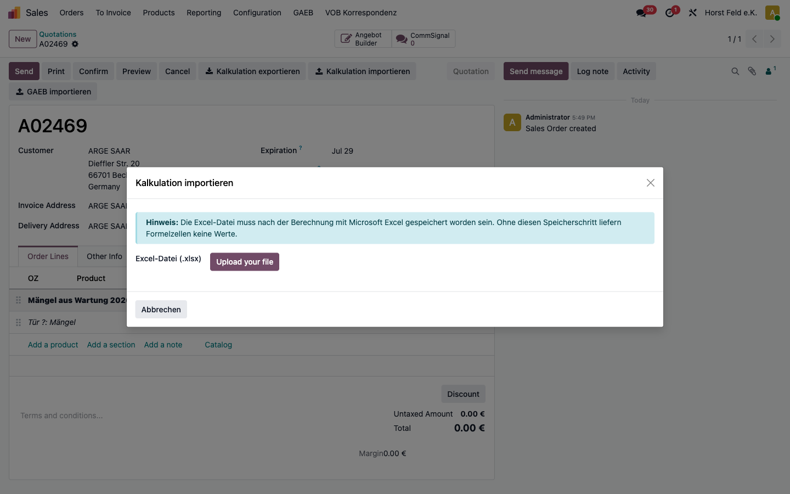

# Kalkulations-Sync Excel – Anwenderhandbuch

Dieses Handbuch beschreibt den vollständigen Arbeitsablauf: Angebotspositionen als
Excel-Datei exportieren, extern kalkulieren und die geänderten Werte wieder ins
Angebot importieren.

Die Beschriftungen in diesem Handbuch (Buttons, Felder) sind im Modul fest auf
Deutsch hinterlegt und erscheinen unabhängig von der Sprache der Benutzeroberfläche.
Die Menüpfade können je nach Sprache der Oberfläche leicht abweichen; in Klammern
steht jeweils der englische Menüname.

## Inhalt

1. [Voraussetzungen](#1-voraussetzungen)
2. [Einrichtung](#2-einrichtung)
3. [Template erstellen](#3-template-erstellen)
4. [Kalkulation exportieren](#4-kalkulation-exportieren)
5. [Externe Bearbeitung](#5-externe-bearbeitung)
6. [Kalkulation importieren](#6-kalkulation-importieren)
7. [Neue Positionen anlegen](#7-neue-positionen-anlegen)
8. [Unterstützte und übersprungene Feldtypen](#8-unterstützte-und-übersprungene-feldtypen)
9. [Häufige Fehler und Lösungen](#9-häufige-fehler-und-lösungen)

---

## 1. Voraussetzungen

- Das Modul **Kalkulations-Sync Excel** ist installiert.
- Du arbeitest in der App **Verkauf** (Sales) mit einem Angebot im Status **Angebot**
  oder **Angebot gesendet** (Quotation / Quotation Sent). In allen anderen Status
  (z. B. *Auftrag*) sind die Buttons ausgeblendet.
- Dein Benutzer gehört zur Gruppe **Verkäufer** (Sales / User). Ohne diese Gruppe
  sind die Buttons nicht sichtbar.
- Für die externe Bearbeitung steht **Microsoft Excel** zur Verfügung (siehe
  [Abschnitt 5](#5-externe-bearbeitung) zum Hintergrund der Formel-Werte).

---

## 2. Einrichtung

Diese Schritte werden in der Regel einmalig pro Firma durchgeführt.

### 2.1 Excel-Template hinterlegen

**Ziel:** Festlegen, wie die exportierte Kalkulationsdatei aussieht und welche
Felder importiert werden.

**Voraussetzung:** Administrator- bzw. Einstellungsrechte für die Verkauf-Einstellungen.

**Schritte:**

1. Menü **Einstellungen** (Settings) öffnen.
2. Reiter **Verkauf** (Sales) wählen.
3. Den Block **Kalkulations-Sync** suchen.
4. Beim Feld **Excel-Template** auf das Upload-Symbol klicken und deine `.xlsx`-Datei
   hochladen.
5. Oben auf **Speichern** (Save) klicken.


**Ergebnis:** Das Template ist hinterlegt und wird bei jedem Export verwendet.

**Hinweise:**

- Bei einer Neuinstallation wird automatisch eine mitgelieferte Vorlage
  (`Vorlage_Kalkulation.xlsx`) in alle Firmen ohne eigenes Template eingespielt. Du
  kannst direkt loslegen oder die Vorlage durch eine eigene ersetzen.
- Das Template muss in genau einer Zelle den Platzhalter `{{line.id}}` enthalten,
  sonst bricht der Export mit einer Fehlermeldung ab (siehe
  [Abschnitt 3](#3-template-erstellen)).

### 2.2 Standardprodukt für neue Positionen (optional)

**Ziel:** Ein Fallback-Produkt festlegen, das verwendet wird, wenn beim Import eine
neue Position **ohne** eigenen Produktbezug angelegt wird.

**Schritte:**

1. Im selben Block **Kalkulations-Sync** das Feld **Standard-Produkt für neue
   Positionen** öffnen.
2. Ein Produkt auswählen und **Speichern**.

**Ergebnis:** Neue Positionen (über `N` in der ID-Spalte oder eine kopierte Zeile),
die kein eigenes Produkt mitbringen, werden mit diesem Produkt angelegt.

**Hinweise:**

- Ist kein Standardprodukt konfiguriert und enthält eine neue Zeile kein Produkt,
  bricht der gesamte Import mit einer Fehlermeldung ab. Für reine
  Mengen-/Preis-Updates bestehender Positionen wird das Feld nicht benötigt.

---

## 3. Template erstellen

Das Template ist eine normale Excel-Datei mit Platzhaltern und Markern. Es bestimmt
allein, **was** exportiert und importiert wird — der Programmcode muss dafür nicht
geändert werden.

### 3.1 Pflichtbestandteil: `{{line.id}}`

In genau **einer Zelle** muss `{{line.id}}` stehen. Diese Zelle markiert die
**Masterzeile** — die Zeile, die Odoo für jede Angebotsposition dupliziert.

- Ohne `{{line.id}}` bricht der Export mit einer Fehlermeldung ab.
- Die ID-Zelle darf in der exportierten Datei **nie** manuell verändert werden
  (Ausnahme: `N` für neue Positionen, siehe [Abschnitt 7](#7-neue-positionen-anlegen)).

### 3.2 Variante A – Platzhalter `{{line.feld}}` (einfachste Methode)

Schreibe Platzhalter direkt in die Masterzeile. Beim Export wird der Wert
eingetragen, beim Import der geänderte Wert zurückgelesen — sofern das Feld
beschreibbar ist.

```
Spalte A:   {{line.id}}
Spalte B:   {{line.product_id.name}}
Spalte C:   {{line.product_uom_qty}}
Spalte D:   {{line.price_unit}}
Spalte F:   {{line.name}}
```

Beispiele für Platzhalter:

| Platzhalter | Bedeutung |
|---|---|
| `{{line.id}}` | Positions-ID (Pflicht) |
| `{{line.product_uom_qty}}` | Menge |
| `{{line.price_unit}}` | VK-Preis |
| `{{line.purchase_price}}` | EK-Preis (nur mit installiertem `sale_margin`) |
| `{{line.name}}` | Positionsbezeichnung |
| `{{line.<beliebiges_feld>}}` | Jedes weitere `sale.order.line`-Feld |

### 3.3 Variante B – Marker `[feld]` in der Kopfzeile (für Formel-Spalten)

Wenn ein Wert **nicht** als Platzhalter, sondern per Formel in der Masterzeile
berechnet wird, kann die Spalte trotzdem importiert werden. Dafür steht in einer
Zeile **oberhalb** der Masterzeile ein Marker in eckigen Klammern — in **derselben
Spalte** wie die Formel.

```
Zeile N-1 (Marker):   [product_uom_qty]   [price_unit]   GP %
Zeile N   (Anzeige):  Menge               VK-Preis       (keine Aktion)
Zeile N+1 (Master):   {{line.id}}   =Formel Menge   =Formel EP   =GP-Formel
```

- Der Präfix `line.` ist optional: `[price_unit]` und `[line.price_unit]` sind
  gleichwertig.
- Deutsche Klarnamen werden erkannt (Groß-/Kleinschreibung egal):

  | Marker | Entspricht Feld |
  |---|---|
  | `[Menge]` | `product_uom_qty` |
  | `[Preis je Einheit]` / `[Preis je ME]` | `price_unit` |
  | `[Kosten je Einheit]` / `[Kosten je ME]` | `purchase_price` |
  | `[Bezeichnung]` | `name` |
  | `[x_gaeb_menge]` | direkt der technische Feldname |

- Spalten **ohne** Marker und ohne `{{line.feld}}`-Platzhalter werden beim Import
  ignoriert (z. B. eine reine GP-%-Formelspalte).
- Stehen Marker in mehreren Zeilen oberhalb der Masterzeile, gewinnt die der
  Masterzeile am nächsten liegende.

### 3.4 Kopfzeilen-Platzhalter `{{object.feld}}`

Außerhalb der Masterzeile können Werte des Angebots eingebettet werden. Diese werden
beim Export befüllt und beim Import **ignoriert**:

```
{{object.name}}              → Angebotsnummer
{{object.partner_id.name}}   → Kundenname
{{object.date_order}}        → Angebotsdatum
{{object.user_id.name}}      → Zuständiger Verkäufer
```

### 3.5 Formeln und Summen

- Formeln in der Masterzeile werden beim Export pro Position kopiert; relative
  Zeilenbezüge (z. B. `=C5*D5`) werden automatisch verschoben (`=C6*D6`, `=C7*D7` …).
- Absolute Bezüge mit `$` (z. B. `$D$1`) bleiben unverändert.
- Summenformeln unterhalb des Datenblocks (z. B. `=SUMME(C5:C5)`) werden automatisch
  auf den gesamten Bereich erweitert (`=SUMME(C5:C[letzte Zeile])`).

### 3.6 Checkliste vor dem Hochladen

- [ ] `{{line.id}}` ist in genau einer Zelle vorhanden.
- [ ] Jede importierbare Spalte hat entweder `{{line.feld}}` in der Masterzeile oder
      `[feld]` in einer darüberliegenden Zeile.
- [ ] Marker für Formel-Spalten stehen in derselben Spalte wie die Formel.
- [ ] Keine Marker auf berechnete (nicht gespeicherte) Felder — diese werden beim
      Import ohnehin übersprungen.
- [ ] Die Datei lässt sich in Excel öffnen und alle Formeln werden berechnet.

> **Mitgeliefertes Beispiel:** Unter `static/templates/kalkulation_template.xlsx`
> liegt eine einsatzbereite Vorlage, die beide Varianten demonstriert. Sie lässt
> sich direkt unter *Einstellungen → Verkauf → Kalkulations-Sync → Excel-Template*
> hochladen.

---

## 4. Kalkulation exportieren

**Ziel:** Die Positionen eines Angebots als gefüllte Excel-Datei herunterladen.

**Voraussetzung:** Angebot im Status **Angebot** oder **Angebot gesendet**, Template
ist hinterlegt, mindestens eine Auftragsposition vorhanden.

**Schritte:**

1. Das Angebot in der App **Verkauf** öffnen.
2. Im Formularkopf auf **Kalkulation exportieren** klicken.
   *(Alternativ über das Zahnrad-/Aktionsmenü → „⬇ Kalkulation exportieren".)*

**Ergebnis:**

- Die Datei wird sofort heruntergeladen. Der Dateiname folgt dem Muster
  `JJMMTT_Kalk_<Kunde>_<Angebotsnummer>.xlsx`.
- Zusätzlich wird die Datei als Anhang im **Chatter** des Angebots gespeichert und
  ein Protokolleintrag erstellt.

**Hinweise:**

- Abschnitte und Notizen (Section/Note-Zeilen) werden nicht als Positionen
  exportiert.
- In der versteckten Tabelle `kalksync_meta` legt der Export Zeitstempel,
  Angebots-ID und Spalten-Zuordnung ab. **Dieses Blatt nicht löschen** — es wird
  beim Import benötigt.

---

## 5. Externe Bearbeitung

**Ziel:** Die Kalkulation außerhalb von Odoo anpassen (Mengen, Preise, weitere
gemappte Felder).

**Schritte:**

1. Die exportierte `.xlsx`-Datei in **Microsoft Excel** öffnen.
2. Werte in den gemappten Spalten anpassen.
3. Die Datei **speichern** (im `.xlsx`-Format).

**Wichtig:**

- **Die ID-Spalte nicht verändern.** Jede Zeile wird über die Positions-ID
  zugeordnet. Wird die ID überschrieben oder gelöscht, kann die Zeile nicht
  importiert werden (Ausnahme: bewusste `N`-Zeilen für neue Positionen).
- **Datei nach dem Rechnen speichern.** Excel berechnet Formeln und legt die
  Ergebnisse in einem internen Zwischenspeicher (Cache) ab. Dieser Cache wird erst
  beim **Speichern** geschrieben. Wird die Datei nicht in Excel geöffnet und
  gespeichert, liefern reine Formelzellen beim Import **keinen** Wert, und die
  betroffenen Zeilen erscheinen als Fehler.
- Das versteckte Blatt `kalksync_meta` nicht löschen.

**Ergebnis:** Eine gespeicherte Datei mit berechneten Werten, bereit für den Import.

---

## 6. Kalkulation importieren

**Ziel:** Die geänderten Werte aus der Excel-Datei zurück ins Angebot übernehmen.

**Voraussetzung:** Dieselbe (oder aus demselben Export hervorgegangene) Datei, in
Excel gespeichert.

**Schritte:**

1. Das Angebot öffnen und im Formularkopf auf **Kalkulation importieren** klicken.
2. Im Dialog **Kalkulation importieren** unter **Excel-Datei (.xlsx)** die Datei
   hochladen.
3. Die **Differenzansicht** prüfen (siehe unten).
4. Auf **Bestätigen** klicken.



**Die Differenzansicht verstehen:**

Nach dem Hochladen zeigt eine Tabelle pro geändertem Feld den **Odoo-Wert** und den
**Excel-Wert** mit einer **Differenz**. Über die Zähl-Badges oben siehst du auf einen
Blick, wie viele Zeilen welchen Status haben. Die Farben:

| Status | Bedeutung |
|---|---|
| **Geändert** | Der Excel-Wert weicht vom Odoo-Wert ab und wird übernommen. |
| **Unverändert** | Keine Abweichung (standardmäßig ausgeblendet). |
| **Neu** | Zeile mit `N` → es wird eine neue Position angelegt. |
| **Fehlend** | Position existiert in Odoo, fehlt aber in der Excel-Datei (Warnung, keine Änderung). |
| **Fehler** | Zeile kann nicht importiert werden (z. B. veränderte ID, fehlender Formelwert). |
| **Ignoriert** | Abschnittszeilen u. ä. werden nicht geändert. |

- Mit dem Schalter **Nur Änderungen anzeigen** kannst du unveränderte Zeilen ein-
  und ausblenden.
- Solange **Fehler**-Zeilen vorhanden sind, ist der Button **Bestätigen** nicht
  verfügbar. Korrigiere zuerst die Excel-Datei und lade sie erneut hoch.

**Ergebnis:**

- Die geänderten Werte werden in die Angebotspositionen geschrieben, neue Positionen
  angelegt.
- Die importierte Datei wird als Anhang im Chatter gespeichert und ein
  Protokolleintrag (Anzahl aktualisierter/neuer Positionen) erstellt.

**Hinweis zur gleichzeitigen Bearbeitung (Concurrency):**

Wurde eine Position **nach** dem Export direkt in Odoo geändert, erscheint im Dialog
ein gelber Warnhinweis mit der betroffenen Position. Der Import überschreibt die
Position trotzdem mit dem Excel-Wert, sobald du bestätigst — prüfe in diesem Fall, ob
der Excel-Wert wirklich der aktuelle sein soll.

---

## 7. Neue Positionen anlegen

**Ziel:** Über die Excel-Datei zusätzliche Angebotspositionen erzeugen.

**Schritte:**

1. In der Excel-Datei eine neue Zeile einfügen (am einfachsten eine bestehende
   Positionszeile kopieren).
2. In die **ID-Zelle** dieser Zeile den Buchstaben **`N`** (oder `n`) schreiben.
3. Die gewünschten Werte in den gemappten Spalten eintragen.
4. Datei speichern und wie in [Abschnitt 6](#6-kalkulation-importieren) importieren.

**Verhalten der ID-Spalte beim Import:**

| ID-Zelle | Verhalten |
|---|---|
| leer | Zeile wird stillschweigend ignoriert (z. B. Summen-/Leerzeilen). |
| `N` oder `n` | Neue Position wird angelegt. |
| Zahl (bestehende ID) | Bestehende Position wird aktualisiert. |
| Zahl, die doppelt vorkommt | Wird als kopierte = neue Position behandelt. |
| anderer Text | Fehler → Import dieser Zeile blockiert. |

**Ergebnis:** Beim Bestätigen werden neue Positionen mit allen importierbaren Feldern
der Zeile angelegt.

**Hinweise:**

- Bringt die neue Zeile kein Produkt mit (kein `{{line.product_id}}`-Mapping), wird
  das **Standardprodukt für neue Positionen** verwendet (siehe
  [Abschnitt 2.2](#22-standardprodukt-für-neue-positionen-optional)). Ist keines
  konfiguriert, bricht der Import ab.

---

## 8. Unterstützte und übersprungene Feldtypen

**Importierbar:**

| Typ | Vergleich | Beispielfelder |
|---|---|---|
| Float / Integer / Monetary | Numerisch, Toleranz `1e-6` | `product_uom_qty`, `price_unit` |
| Char / Text / Html | Zeichenkette (exakt) | `name`, `x_gaeb_oz` |
| Boolean | Ja/Nein | `x_gaeb_manuell` |

**Boolean-Werte in Excel:** `Ja`, `ja`, `1`, `True`, `yes`, `wahr` ergeben **Ja
(True)**; alles andere ergibt **Nein (False)**.

**Automatisch übersprungen (auch wenn im Template):**

- Berechnete, nicht gespeicherte Felder (z. B. eine GP-Formelspalte).
- Relationsfelder: Many2one, One2many, Many2many.
- Binary- und Serialized-Felder.

> **Hinweis zu Many2one-Feldern:** Diese sind bewusst nicht importierbar. Beim Export
> wird der Anzeigename geschrieben; eine Zeichenkette lässt sich beim Import nicht
> zuverlässig wieder auf den richtigen Datensatz auflösen. Solche Spalten dienen nur
> der Anzeige (z. B. Produktname).

---

## 9. Häufige Fehler und Lösungen

| Meldung / Symptom | Ursache | Lösung |
|---|---|---|
| „Kein Kalkulationstemplate konfiguriert." | Kein Template hinterlegt. | Template unter *Einstellungen → Verkauf → Kalkulations-Sync → Excel-Template* hochladen. |
| „Das Template enthält keinen `{{line.id}}`-Platzhalter." | Pflichtplatzhalter fehlt im Template. | `{{line.id}}` in genau eine Zelle der Masterzeile setzen und Template erneut hochladen. |
| „Export ist nur im Status ‚Angebot' oder ‚Angebot gesendet' möglich." | Angebot ist bereits Auftrag/abgeschlossen. | Auf einem Angebot im richtigen Status arbeiten. |
| „Keine Auftragspositionen vorhanden." | Das Angebot hat keine Positionen. | Mindestens eine Produktposition anlegen. |
| „Die Datei wurde nicht mit Kalkulations-Sync exportiert (fehlender ‚kalksync_meta'-Sheet)." | Falsche Datei oder das versteckte Blatt wurde gelöscht. | Erneut exportieren und die Original-Exportdatei verwenden, das Blatt `kalksync_meta` nicht entfernen. |
| „Diese Datei wurde für Angebot ID … exportiert, nicht für das aktuelle Angebot." | Datei eines anderen Angebots hochgeladen. | Die zum geöffneten Angebot passende Datei verwenden. |
| Status **Fehler**: „Formelzelle ohne berechneten Wert …" | Datei wurde nach dem Bearbeiten nicht in Excel gespeichert; Formel-Cache fehlt. | Datei in Microsoft Excel öffnen, **speichern** und erneut importieren. |
| Status **Fehler**: „Positions-ID wurde verändert." | ID-Zelle wurde überschrieben. | ID-Spalte aus der Original-Exportdatei wiederherstellen (für neue Zeilen `N` verwenden). |
| Status **Fehler**: „Positions-ID … ist im Angebot nicht vorhanden." | Position in Odoo gelöscht oder ID manipuliert. | Betroffene Zeile prüfen; ggf. neu exportieren. |
| Status **Fehler**: „Ungültiger Wert ‚…' für Feld ‚…'." | Text in einer Zahlenspalte. | Gültige Zahl eintragen (Komma oder Punkt als Dezimaltrennzeichen sind beide erlaubt). |
| „Neue Position ‚…' kann nicht angelegt werden: kein Produkt zugeordnet und kein Standard-Produkt konfiguriert." | `N`-Zeile ohne Produkt, kein Fallback gesetzt. | Standardprodukt in den Einstellungen hinterlegen oder ein Produkt in die Zeile mappen. |
| Gelbe Warnung: „Position ‚…' wurde seit dem Export in Odoo geändert." | Position wurde nach dem Export direkt in Odoo bearbeitet. | Prüfen, ob der Excel-Wert wirklich übernommen werden soll, bevor du bestätigst. |
| Gelbe Warnung: „Position ‚…' ist im Excel nicht vorhanden." | Zeile in der Excel-Datei fehlt. | Kein Fehler — die Position bleibt unverändert. Bei Bedarf neu exportieren. |
| Excel meldet beim Öffnen „beschädigte Datei". | Bei aktuellen Modulversionen behoben. | Sicherstellen, dass das Modul aktuell ist; die Exportdatei erneut erzeugen. |
